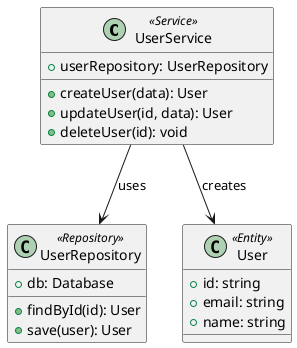

# ArchMate - Auto Architecture Diagram Generator

<p align="center">
  
  
  
</p>

> **ArchMate** is a powerful, open-source tool that automatically generates architecture diagrams from your source code. It uses advanced AST (Abstract Syntax Tree) parsing to extract structural information and produce various diagram formats including UML, C4, ER, Cloud architectures, and Infrastructure as Code visualizations.

## ✨ Features

### Core Capabilities

- **🔍 Static Code Analysis**: Deep AST parsing for multiple programming languages
- **📊 UML Diagram Generation**: Class, Component, Sequence, Activity, and State diagrams
- **🏗️ C4 Model Diagrams**: Context, Container, Component, and Deployment views
- **🗄️ ER Diagrams**: Entity-Relationship diagrams from code models
- **☁️ Cloud Architecture**: AWS, GCP, and Azure architecture visualization
- **📝 IaC Visualization**: Terraform and Kubernetes infrastructure diagrams
- **🎨 Multiple Export Formats**: PlantUML, Mermaid, PNG, SVG, HTML, JSON
- **🔄 Interactive Viewing**: Zoomable, navigable HTML diagram viewer

### Supported Languages

| Language | Status | Parser |
|----------|--------|--------|
| TypeScript | ✅ Full | Babel AST |
| JavaScript | ✅ Full | Babel AST |
| Python | ✅ Full | Regex + AST patterns |
| Java | ✅ Full | Regex patterns |
| C# | ✅ Full | Regex patterns |
| Go | 🔜 Coming | - |
| Rust | 🔜 Coming | - |

### Diagram Types

1. **UML Class Diagrams** - Visualize class structures, inheritance, and relationships
2. **UML Component Diagrams** - Show system components and interfaces
3. **UML Sequence Diagrams** - Display method call sequences and interactions
4. **C4 Model Diagrams** - Context, Container, Component, and Deployment levels
5. **ER Diagrams** - Database schema visualization with relationships
6. **Dependency Graphs** - Module and package dependency visualization
7. **Cloud Architecture** - AWS, GCP, Azure infrastructure diagrams
8. **IaC Diagrams** - Terraform and Kubernetes resource visualization

## 📦 Installation

### Prerequisites

- Node.js 18.0.0 or higher
- npm, yarn, or pnpm

### Install via npm

```bash
npm install -g archmate
```

### Install from source

```bash
git clone https://github.com/moggan1337/ArchMate.git
cd ArchMate
npm install
npm run build
npm link
```

### Verify Installation

```bash
archmate --version
```

## 🚀 Quick Start

### Basic Usage

```bash
# Analyze a directory and generate UML class diagram
archmate generate ./src --type uml-class --format plantuml

# Generate C4 container diagram
archmate generate ./src --type c4-container --format mermaid

# Generate interactive HTML viewer
archmate generate ./src --type uml-class --format html --output ./diagrams
```

### Command Examples

```bash
# Analyze code and show metrics
archmate analyze ./src --json

# List available diagram types
archmate list-types

# List export formats
archmate list-formats

# Watch mode for live updates
archmate watch ./src --type uml-class --format html
```

## 📖 Architecture Recovery

ArchMate uses sophisticated static analysis techniques to recover architecture from source code:

### AST Parsing Pipeline

```
Source Files
     │
     ▼
┌─────────────┐
│  Language   │
│   Parser    │
└─────────────┘
     │
     ▼
┌─────────────┐
│     AST     │
│ Extraction  │
└─────────────┘
     │
     ▼
┌─────────────┐
│   Entity    │
│  Extraction │
└─────────────┘
     │
     ▼
┌─────────────┐
│ Relationship│
│   Analysis  │
└─────────────┘
     │
     ▼
┌─────────────┐
│   Dependency│
│    Graph    │
└─────────────┘
     │
     ▼
┌─────────────┐
│   Diagram   │
│ Generation  │
└─────────────┘
```

### Entity Extraction

ArchMate extracts the following entity types:

- **Classes**: Full class structures with properties and methods
- **Interfaces**: Interface definitions and method signatures
- **Enums**: Enumeration values and types
- **Functions**: Standalone function declarations
- **Services**: Classes with `@Service` or `Service` annotations
- **Controllers**: Classes with `@Controller` or `RestController` annotations
- **Repositories**: Classes with `@Repository` annotations
- **Models**: Classes with `@Entity` or `@Model` annotations
- **Components**: Classes with `@Component` annotations

### Relationship Detection

ArchMate automatically detects these relationships:

| Relationship | Detection Method |
|-------------|------------------|
| `extends` | Inheritance declarations |
| `implements` | Interface implementation |
| `uses` | Dependency injection, composition |
| `calls` | Method invocations in body |
| `associates` | Property type references |
| `aggregates` | Container relationships |
| `depends-on` | Import statements |

## 📊 UML Generation

### UML Class Diagrams

Generate comprehensive class diagrams showing:

- Class names and stereotypes
- Properties with types and visibility
- Methods with parameters and return types
- Inheritance hierarchies
- Interface implementations
- Dependency relationships

```bash
archmate generate ./src --type uml-class --format plantuml
```

**Output Example (PlantUML):**


### UML Sequence Diagrams

Generate sequence diagrams from method call chains:

```bash
archmate generate ./src --type uml-sequence --format mermaid
```

**Features:**
- Automatic actor/object detection
- Method call ordering
- Return value tracking
- Loop and alternative block detection
- Asynchronous message support

### UML Component Diagrams

Generate component diagrams showing:

- System components
- Provided/required interfaces
- Component dependencies
- Connectors and ports

## 🏗️ C4 Model Diagrams

The C4 model provides four levels of abstraction:

### Level 1: Context

```bash
archmate generate ./src --type c4-context --format plantuml
```

Shows the system as a whole with external actors.

### Level 2: Container

```bash
archmate generate ./src --type c4-container --format plantuml
```

Shows the major structural containers (applications, databases, etc.).

### Level 3: Component

```bash
archmate generate ./src --type c4-component --format plantuml
```

Shows the components within each container.

### Level 4: Deployment

```bash
archmate generate ./src --type c4-deployment --format plantuml
```

Shows deployment nodes and runtime infrastructure.

## 🗄️ Entity-Relationship Diagrams

Generate ER diagrams from data models:

```bash
archmate generate ./src --type er-diagram --format mermaid
```

**Features:**
- Automatic table inference from model classes
- Primary key detection
- Foreign key relationship detection
- Column type mapping
- Multiple notation support (Crow's Foot, UML, IDEF1X)

## ☁️ Cloud Architecture

### AWS Architecture

```bash
archmate generate ./src --type cloud-aws --format plantuml
```

Maps entities to AWS resources:
- Controllers → EC2/ECS/Lambda
- Services → Lambda/ECS Services
- Repositories → RDS/DynamoDB
- Models → S3/DynamoDB Tables

### GCP Architecture

```bash
archmate generate ./src --type cloud-gcp --format plantuml
```

Maps entities to GCP resources:
- Compute Engine instances
- Cloud Functions
- Cloud SQL
- Cloud Storage buckets
- Cloud Run services

### Azure Architecture

```bash
archmate generate ./src --type cloud-azure --format plantuml
```

Maps entities to Azure resources:
- Virtual Machines
- Azure Functions
- Azure SQL
- Blob Storage
- App Services

## 📝 Infrastructure as Code

### Terraform Diagrams

```bash
archmate generate ./src --type iac-terraform --format plantuml
```

Maps entities to Terraform resources:
- Classes → aws_resource blocks
- Services → aws_lambda_function
- Repositories → aws_db_instance
- Models → aws_dynamodb_table

### Kubernetes Diagrams

```bash
archmate generate ./src --type iac-kubernetes --format mermaid
```

Maps entities to Kubernetes resources:
- Controllers → Deployment
- Services → Service
- Repositories → PersistentVolumeClaim
- Models → ConfigMap

## 🎨 Export Formats

### PlantUML

```bash
archmate generate ./src --format plantuml --output diagram.puml
```

Best for:
- Professional documentation
- Multiple diagram tools
- LaTeX integration
- Version control friendly

### Mermaid

```bash
archmate generate ./src --format mermaid --output diagram.mmd
```

Best for:
- Markdown documentation
- GitHub/GitLab wikis
- VS Code Markdown Preview
- Notion and Confluence

### HTML Interactive Viewer

```bash
archmate generate ./src --format html --output ./diagrams
```

**Features:**
- Pan and zoom controls
- Metadata panel
- Code/diagram toggle
- Dark/light theme
- Export functionality

### PNG/SVG

```bash
archmate generate ./src --format png --output diagram.png
```

Requires network access to PlantUML server for rendering.

### JSON

```bash
archmate generate ./src --format json --output diagram.json
```

Includes full metadata for programmatic processing.

## 🔧 Configuration

### Programmatic Usage

```typescript
import { 
  CodeAnalyzer, 
  UMLClassDiagramGenerator,
  DiagramExporter 
} from 'archmate';

// Analyze source code
const analyzer = new CodeAnalyzer();
const result = await analyzer.analyze('./src', 'typescript');

// Generate diagram
const generator = new UMLClassDiagramGenerator({ 
  format: 'plantuml',
  showVisibility: true,
  showTypes: true,
  showMethods: true,
});
const content = generator.generate(result.entities, result.relationships);

// Export
const exporter = new DiagramExporter({ format: 'html' });
const output = await exporter.export(content, 'uml-class', {
  entityCount: result.entities.length,
  relationshipCount: result.relationships.length,
});
await exporter.save(output, 'my-diagram');
```

### Configuration Options

#### Analyzer Options

| Option | Type | Default | Description |
|--------|------|---------|-------------|
| `includeExternal` | boolean | false | Include external dependencies |
| `maxFileSize` | number | 1048576 | Max file size in bytes |
| `ignorePaths` | string[] | [node_modules, ...] | Paths to ignore |
| `parseComments` | boolean | true | Parse documentation comments |
| `resolveImports` | boolean | true | Resolve import statements |

#### Generator Options

| Option | Type | Default | Description |
|--------|------|---------|-------------|
| `format` | string | plantuml | Output format |
| `showVisibility` | boolean | true | Show visibility modifiers |
| `showTypes` | boolean | true | Show type information |
| `showMethods` | boolean | true | Show methods |
| `showProperties` | boolean | true | Show properties |
| `groupBy` | string | none | Grouping strategy |

## 📈 Analysis Metrics

ArchMate provides code quality metrics:

### Coupling

- **Afferent Coupling (CA)**: Number of classes that depend on this class
- **Efferent Coupling (CE)**: Number of classes this class depends on
- **Instability**: CE / (CA + CE)

### Cohesion

- **Lack of Cohesion (LCOM)**: Measures how related methods are to their class
- **Method cohesion**: Percentage of methods accessing instance variables

### Complexity

- **Cyclomatic Complexity**: Number of linearly independent paths
- **Depth of Inheritance (DIT)**: Longest path from root class

## 🛠️ Development

### Project Structure

```
ArchMate/
├── src/
│   ├── analysis/          # Code analysis engine
│   │   ├── analyzer.ts    # Main analyzer class
│   │   └── index.ts
│   ├── exporters/         # Export handlers
│   │   ├── diagram-exporter.ts
│   │   └── index.ts
│   ├── generators/        # Diagram generators
│   │   ├── c4-generator.ts
│   │   ├── cloud-generator.ts
│   │   ├── diagram-generator.ts
│   │   ├── er-generator.ts
│   │   ├── iac-generator.ts
│   │   ├── sequence-generator.ts
│   │   └── index.ts
│   ├── parsers/           # Language parsers
│   │   ├── typescript-parser.ts
│   │   ├── javascript-parser.ts
│   │   ├── python-parser.ts
│   │   ├── java-parser.ts
│   │   ├── csharp-parser.ts
│   │   └── index.ts
│   ├── cli/              # Command-line interface
│   │   └── index.ts
│   ├── types.ts          # Type definitions
│   └── index.ts          # Main exports
├── tests/                # Test files
├── examples/              # Example usage
├── docs/                  # Documentation
└── package.json
```

### Building

```bash
# Install dependencies
npm install

# Run TypeScript compiler
npm run build

# Run tests
npm test

# Lint code
npm run lint
```

### Testing

```bash
# Run all tests
npm test

# Run with coverage
npm test -- --coverage

# Watch mode
npm test -- --watch
```

## 🤝 Contributing

Contributions are welcome! Please read our contributing guidelines before submitting PRs.

### Guidelines

1. Follow the existing code style
2. Add tests for new features
3. Update documentation
4. Keep commits atomic
5. Write meaningful commit messages

## 📚 Documentation

- [User Guide](./docs/user-guide.md)
- [API Reference](./docs/api.md)
- [Examples](./examples/)
- [FAQ](./docs/faq.md)

## 🐛 Troubleshooting

### Common Issues

**Q: Diagrams not rendering in VS Code**
A: Install a PlantUML or Mermaid extension for your editor.

**Q: "Cannot find module" errors**
A: Ensure you've run `npm run build` after installation.

**Q: Empty diagrams generated**
A: Check that your source files match the expected patterns and extensions.

## 📄 License

MIT License - see [LICENSE](./LICENSE) for details.

## 🙏 Acknowledgments

- [Babel](https://babeljs.io/) for AST parsing
- [PlantUML](https://plantuml.com/) for diagram rendering
- [Mermaid](https://mermaid-js.github.io/) for diagram syntax
- [C4 Model](https://c4model.com/) for architecture visualization

## 📞 Support

- [GitHub Issues](https://github.com/moggan1337/ArchMate/issues)
- [Documentation](./docs/)
- [Discussions](./discussions/)

---

<p align="center">
  Made with ❤️ by the ArchMate team
</p>
